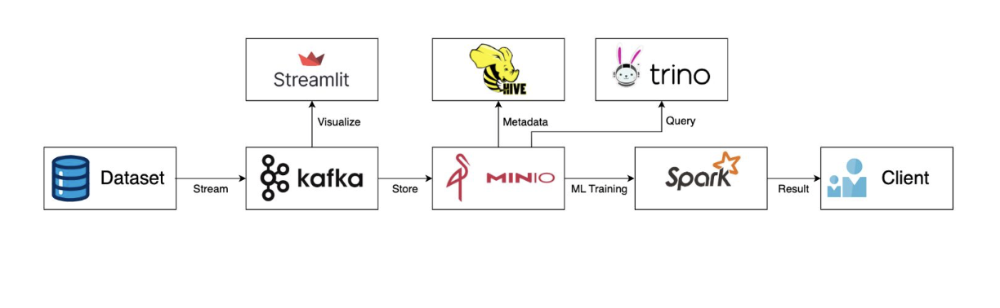

# Sistem Rekomendasi Lagu Big Data

## Deskripsi
Sistem rekomendasi lagu yang scalable menggunakan teknologi big data seperti Kafka, Spark, MinIO, dan Trino. Sistem ini menyediakan rekomendasi lagu real-time menggunakan algoritma machine learning yang di-deploy dalam environment containerized.

## Arsitektur


Sistem ini mengikuti arsitektur big data modern:
- **Kafka**: Stream processing untuk data real-time
- **MinIO**: Object storage untuk dataset dan model
- **Spark**: Machine learning training dan processing
- **Trino**: SQL query engine untuk analitik data
- **Flask API**: Backend service rekomendasi
- **Streamlit**: Dashboard interaktif untuk visualisasi

## Struktur Project
```
big-data-song-recommendation/
├── src/
│   ├── app.py                    # Flask API (backend)
│   ├── streamlit_app.py          # Streamlit dashboard (frontend)
│   ├── data/
│   │   ├── __init__.py
│   │   └── preprocessor.py       # Logic preprocessing data
│   ├── models/
│   │   ├── __init__.py
│   │   └── recommendation_engine.py
│   ├── api/
│   │   ├── __init__.py
│   │   └── routes.py
│   └── utils/
│       ├── __init__.py
│       └── helpers.py
├── data/
│   ├── raw/                      # Dataset asli (file CSV)
│   ├── processed/                # Dataset yang sudah diproses
│   └── models/                   # Model ML yang sudah ditraining
├── docker/
│   ├── Dockerfile
│   └── docker-compose.yml
├── requirements.txt
├── .gitignore
├── .dockerignore
└── README.md
```

## Prerequisites
- Docker Desktop terinstall dan berjalan
- Git

## Cara Setup

1. **Clone Repository**
   ```bash
   git clone <repository-url>
   cd big-data-song-recommendation
   ```

2. **Jalankan Application Stack**
   ```bash
   cd docker
   docker compose up --build
   ```