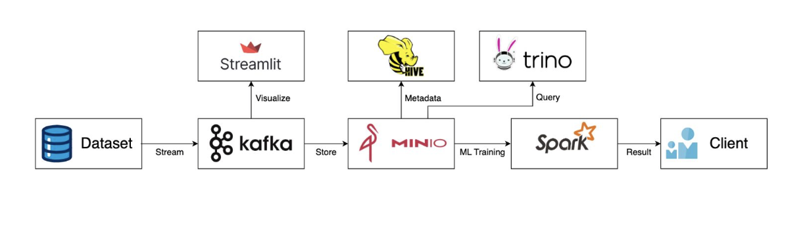

# Sistem Rekomendasi Lagu Big Data

Sistem rekomendasi lagu yang scalable menggunakan teknologi big data seperti Kafka, Spark, MinIO, dan Trino. Sistem ini menyediakan rekomendasi lagu real-time menggunakan algoritma machine learning yang di-deploy dalam environment containerized.

Anggota Kelompok :
|Nama|NRP|
|----|---|
|Revalina Fairuzy Axhari P.|5027231001|
|Farida Qurrotu A'yuna|5027231015|
|Adlya Isriena Aftarisya|5027231066|
|Nayyara Ashila|5027231083|


## Daftar Isi
- [Latar Belakang](#latar-belakang)
- [Tujuan](#tujuan)
- [Arsitektur](#arsitektur)
- [Struktur Project](#struktur-project)
- [Prerequisites](#prerequisites)
- [Cara Setup](#cara-setup)
- [Workflow](#workflow)
- [Dokumentasi Pengerjaan](#dokumentasi-pengerjaan)
   - [Web MusicBot](#tampilan-web-musicbot)
   - [Rekomendasi by Popularity ](#rekomendasi-berdasar-popularitas-lagu)
   - [Fitur Direct Link](#fitur-direct-link-to-song)

## Latar Belakang

Di era digital, pengguna menghadapi kesulitan dalam menemukan lagu yang sesuai preferensi mereka karena:

- Banyaknya lagu baru yang dirilis setiap hari
- Algoritma rekomendasi standar cenderung bias ke artis besar

## Tujuan

- Mengelompokkan lagu berdasarkan kemiripan menggunakan **KMeans**
- Menerapkan pipeline data terintegrasi: Kafka → MinIO → Spark
- Memberikan antarmuka interaktif kepada pengguna (melalui Streamlit)
- Membangun sistem modular dan dapat diskalakan untuk rekomendasi musik

## Arsitektur


Sistem ini mengikuti arsitektur big data modern:
- **Kafka**: Stream processing untuk data real-time
- **MinIO**: Object storage untuk dataset dan model
- **Spark**: Machine learning training dan processing
- **Trino**: SQL query engine untuk analitik data
- **Flask API**: Backend service rekomendasi
- **Streamlit**: Dashboard interaktif untuk visualisasi

## Struktur Project
```
big-data-song-recommendation/
├── src/
│   ├── app.py                    # Flask API (backend)
│   ├── streamlit_app.py          # Streamlit dashboard (frontend)
│   ├── data/
│   │   ├── __init__.py
│   │   └── preprocessor.py       # Logic preprocessing data
│   ├── models/
│   │   ├── __init__.py
│   │   └── recommendation_engine.py
│   ├── api/
│   │   ├── __init__.py
│   │   └── routes.py
│   └── utils/
│       ├── __init__.py
│       └── helpers.py
├── data/
│   ├── raw/                      # Dataset asli (file CSV)
│   ├── processed/                # Dataset yang sudah diproses
│   └── models/                   # Model ML yang sudah ditraining
├── docker/
│   ├── Dockerfile
│   └── docker-compose.yml
├── requirements.txt
├── .gitignore
├── .dockerignore
└── README.md
```

## Prerequisites
- Docker Desktop terinstall dan berjalan
- Git

## Cara Setup

1. **Clone Repository**
   ```bash
   git clone <repository-url>
   cd big-data-song-recommendation
   ```

2. **Jalankan Application Stack**
   ```bash
   cd docker
   docker compose up --build
   ```

## Workflow

### 1. Training Model & Preprocessing

📄`src/spark/training.py`  
📄`src/models/recommendation_engine.py`

- Membaca dataset lagu dari data/raw/song_emotion_data.json
- Melakukan normalisasi dan ekstraksi fitur emosi (valence, energy, danceability, dll.)
- Melatih model KMeans clustering berdasarkan fitur audio
- Menyimpan model ke data/models/content_based/
- Metadata disimpan ke data/models/metadata/ untuk keperluan tracking dan evaluasi
---

### 2. Streaming Data & Pengambilan Preferensi

📄`streaming/kafka_consumer.py`  
📄`streaming/run_streaming.py`  
📄`src/storage/minio_client.py`

- Menjalankan simulasi aliran data preferensi pengguna menggunakan Kafka
- Konsumen Kafka membaca data dan menyimpannya ke MinIO (object storage)
- Preferensi pengguna disimpan dalam format .json ke dalam folder data/users/

---

### 3. Penyediaan Rekomendasi Lagu via API

📄`src/app.py`    
📄`src/api/routes.py`   
📄`src/models/recommendation_engine.py`

- Backend Flask menyajikan endpoint untuk:
   -  `/recommend/content/<track_name>` → Rekomendasi lagu serupa berdasarkan model KMeans
   - `/songs` → Menampilkan daftar lagu (dari dataset statis)
   - `/models/info` → Menampilkan informasi model dan metadata
- Model dan data diambil dari MinIO menggunakan **minio_client.py**
- Inferensi dilakukan menggunakan PySpark

---

### 4. Visualisasi Interaktif (Streamlit)

📄`streaming/streamlit_app.py`

- Antarmuka interaktif untuk memilih lagu dan melihat rekomendasi
- Fitur tambahan:

   - Tombol **"Like"** untuk menyukai lagu
   - Tautan langsung ke Spotify untuk mendengarkan lagu yang direkomendasikan

## Dokumentasi Pengerjaan 

### Tampilan web MusicBot


Berikut merupakan tampilan dari web MusicBot, yang akan memberikan rekomendasi musik kepada user melalui popularitas lagu dari data yang ada. Beberapa fitur lain yang melengkapi adalah adanya fitur klik 'like' untuk user ketika user menyukai suatu lagu, serta klik 'direct link to song' untuk memberikan pengalaman mendengarkan lagu langsung kepada user dengan mengarahkan mereka ke aplikasi Spotify untuk mendengarkan lagu sesuai preferensi.

---

### Rekomendasi berdasar popularitas lagu


Rekomendasi lagu diberikan berdasar data popularitas dari tiap lagu, sehingga pengguna bisa mendapatkan rekomendasi lagu untuk didengarkan.

---

### Fitur direct link to song

https://github.com/user-attachments/assets/488e15c0-d8ba-4ed3-9532-721bd97dcc04

Fitur direct link to song untuk memberikan pengalaman yang lebih kaya kepada pengguna tidak hanya sekadar menerima rekomendasi, tetapi juga langsung mendengarkan lagunya melalui Spotify.

---

<p align="center"><strong style="font-size: 32px;">TERIMA KASIH</strong></p>
<p align="center">💖semoga harimu seindah playlist favoritmu💖</p>
<p align="center">
  
</p>
